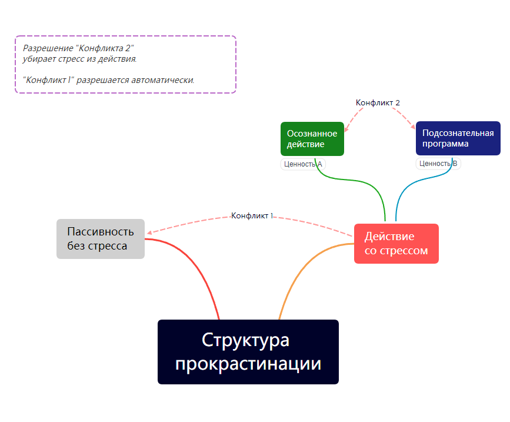

#  Прокрастинация: двойной конфликт 

В этой статье я хочу поделиться своей рабочей моделью рассоздания прокрастинации (откладывания на потом) которой я пользуюсь сам и в работе с клиентами: модель двойного конфликта и его распутывания.

На тему прокрастинации уже написаны сотни статей и книг, изобретены десятки методов "борьбы", преодоления и трансформации прокрастинации в действие. Здесь как с диетами: бы была одна универсальная, не приходилось бы изобретать новых. Та же история с прокрастинацией: у этого явления множество причин, и нет одного универсального подхода.

Универсального подхода нет, но я считаю эту модель "в меру универсальной". Она может быть избыточна для простых случаев, но хорошо зарекомендовала себя для сложных и хронических ситуаций прокрастинации у меня и клиентов. Почему? Эта модель имеет дело не с "зоопарком причин", а со *структурой* прокрастинации. А структура у неё простая: двойной внутренний конфликт.

#### Конфликт 1

Начну с того, что прокрастинация - это не вопрос управления временем, списками дел или волей, это вопрос управления *эмоциями*. Если запланированное дело вызывает стресс - я могу выбрать "не испытывать стресс": отложить дело, чтобы в моменте "чувствовать себя эмоционально лучше" (пусть даже это усилит стресс в долгосрочной перспективе). Другими словами, мы имеем внутренний конфликт между действием-со-стрессом и покоем-без-стресса. Что выбрать? Обе опции не выглядят привлекательными.

> Если стресс не сверхсильный и у человека достаточно внутреннего ресурса действовать - это оптимальный сценарий. Здесь могут помочь простые решения для повышения уровня энергии: поддерживающее окружение, качественный отдых и режим дня, питание и витамины, психотерапия, медитации и фокус на целях. Тогда часть накопленной энергии пойдёт на преодоление стресса, часть - на само действие. Но иногда, по ряду причин, этот сценарий не срабатывает. Только в этом случае подключаем "тяжёлую артиллерию": модель двух конфликтов.

* **Шаг 1:** Признать факт наличия конфликта между действием-со-стрессом и покоем-без-стресса. Да, они конфликтуют. Да, приходится выбирать.
* **Шаг 2:** Вспомнить, что внутренние конфликты разрешаются на уровне ценностей. Обнаружить обе ценности. Со стороны "дела" - это могут быть "действие, проявленность, что-то ещё...стоит прояснить конкретику: что я ценю такого, ради чего действую". Со стороны бездействия - "приятное эмоциональное состояние, (возможно что-то ещё)".
* **Шаг 3:** Поставить перед собой задачу: воплотить обе ценности одновременно. Как одновременно действовать и чувствовать себя хорошо? Уже этот вопрос может привести к неожиданным ответам. Ну и у меня есть "стандартный ответ": сделать так, чтобы действие вызывало не стресс, а приятные ощущения. А для этого стоит вспомнить, что стресс - это всегда показатель внутреннего конфликта. (Ещё один внутренний конфликт? Ага!). И значит стоит его обнаружить и разрешить.
* **Шаг 4.** Остаётся обнаружить и разрешить второй внутренний конфликт, который активируется при действии.

#### Конфликт 2

Когда действие вызывает стресс -- это всегда **конфликт осознанного действия с подсознательной программой**. Зачастую достаточно направить на подсознательную программу внимание, чтобы прояснить заложенные в неё ценности. И когда ценности обеих сторон конфликта ясны - можно приступать к его разрешению. 

При разрешении внутреннего конфликта (между осознанным действием и подсознательной программой) есть три варианта развития событий.

**Вариант A:** 

Ценности подсознательной программы устарели. То есть новое осознанное действие конфликтует с привычкой, которая была полезна в прошлом, но не имеет ценности в настоящем.

> Например, получать одобрение от окружающих (и избегать неодобрения) могло было ценным в детстве, но уже потеряло привлекательность, поскольку не направляет жизненные ресурсы на улучшение своей жизни.

Такая осознанная переоценка ценностей у подсознательной программы уже существенно снижает накал конфликта/стресса, уже позволяет действовать ради актуальных ценностей. А устаревшая и потерявшая ценность привычка - если её не подпитывать действиями - со временем исчезает... и вместе с ней разрешается внутренний конфликт.

**Вариант B:** 

Ценности подсознательной программы всё ещё актуальны. То есть конфликтуют актуальные ценности осознанного действия и актуальные ценностей подсознательной программы. Разрешение такого внутреннего конфликта требует найти способ действия, который воплощает обе ценности одновременно. А для этого придётся поменять как подсознательную привычку, так и предполагаемый стиль осознанного действия. 

> Распространённый пример, который встречается у половины моих клиентов - конфликт "эффективности" и "качества". Когда осознанное действие направлено на ценную "эффективность", а подсознательная программа реализует ценность "качество" неадекватным перфекционизмом.  Для разрешения такого конфликта необходимо признать обе ценности своими и найти способ встроить их реализацию в повседневную жизнь. Без перекосов в достигаторство и перфекционизм. 

Признание обеих ценностей своими существенно снижает накал конфликта/стресса и уже позволяет действовать. 

На пути встретится инерция мышления "совместить это - невозможно". Чтобы развеять эту иллюзию, достаточно поискать и найти людей, которые так уже делают.

Наконец, новая привычка воплощения обеих ценностей, со временем, заменит собой две старые конфликтующие привычки, что приведёт к окончательному разрешению конфликта.

**Вариант С:** 

Ценности подсознательной программы не удалось обнаружить. *(Встречается нечасто, чаще всего ценности подсознательной программы видны сразу.)*

В этом, редком случае, я использую сочетание сразу двух стратегий. Одну на уровне действия, другую на уровне осознанности.

**1)** На уровне действия: **действую с созидательным намерением**. Вот как это работает. 

Во-первых, я иду в действие, ради воплощения уже известных мне ценностей (или хотя-бы думаю об этом). Этим самым, естественно, я активирую внутренний конфликт и испытываю стресс. 

Далее, я признаю два факта реальности: (1) я ценю то, ради чего действую и (2) в процессе я испытываю стресс. 

И, наконец, высказываю намерение: Хочу продолжать действовать ради того что люблю и при этом хочу испытывать приятные чувства (желательно их назвать). В этот момент ум получает пачку корректных вводных данных и начинает искать решение. Появляется шанс, что ум разрешит внутренний конфликт на автомате. 

> Кстати, самый простой способ ~~пох~~испортить весь этот замысел - это пожелать "не испытывать стресс" вместо "испытывать приятные чувства". Желание уничтожить что-либо (в данном случае - стресс) включает "негативное мышление", которое запускает совсем другие, неполезные процессы в уме и психике.

**2)** А вот на уровне осознанности: **продолжаю прояснять** подсознательную программу доступными мне инструментами. Начиная с простейших, известных каждому (разговор, дневник, рисунок), и заканчивая специализированными процессинговыми методами, которые проясняют и растворяют подсознательные программы (в моём арсенале: ПЭАТ, RPT, EMT, "Процессинг Игр" и ряд других).

> Процессинг можно сравнить с исследованием подсознательных программ под микроскопом. Занимает время, но даёт колоссальную глубину и чёткость. Вытаскивает любые подсознательные программы на осознанный уровень. Можно использовать в паре со специалистом или самостоятельно.

Сочетание этих двух стратегий для разрешения внутреннего конфликта приводит к одному из двух вариантов:

* Либо - благодаря процессингу - проясняются ценности подсознательной программы, и тогда "Вариант С" превращается в "Вариант А" или "Вариант B".
* Либо - благодаря созидательному мышлению - ум выполнит свою работу: найдёт способ трансформировать стресс во что-то приятное и сам разрешит внутренний конфликт.

Кстати, **Вариант А** - самый распространённый. Большинство внутренних конфликтов вызвано подсознательными программами, которые помогали в прошлом, но уже безнадёжно устарели.

---

#### Итог

В статье я описал рабочий инструмент, который использую для себя и клиентов, но он занимает время и требует внимания. Поэтому я предлагаю не усложнять и не стрелять из пушки по воробьям. 

Иногда для превращения прокрастинации в действие хватает простых инструментов, вроде созидательного мышления, фокусе на целях или создания поддерживающего окружения.

А вот саму модель двойного конфликта я ценю в "особых" случаях:

1. Хроническая прокрастинация в текущем проекте (где попытки действия регулярно чередуются с периодами бездействия)
2. "Отложенные мечты", где попытки действовать не возобновляются уже давно.

Наконец, моё личное профессиональное наблюдение: любое развитие всегда идёт через разрешение внутренних конфликтов. Разрешение конфликтов - это синоним развития. А это значит, что в любой прокрастинации заложен огромный потенциал.